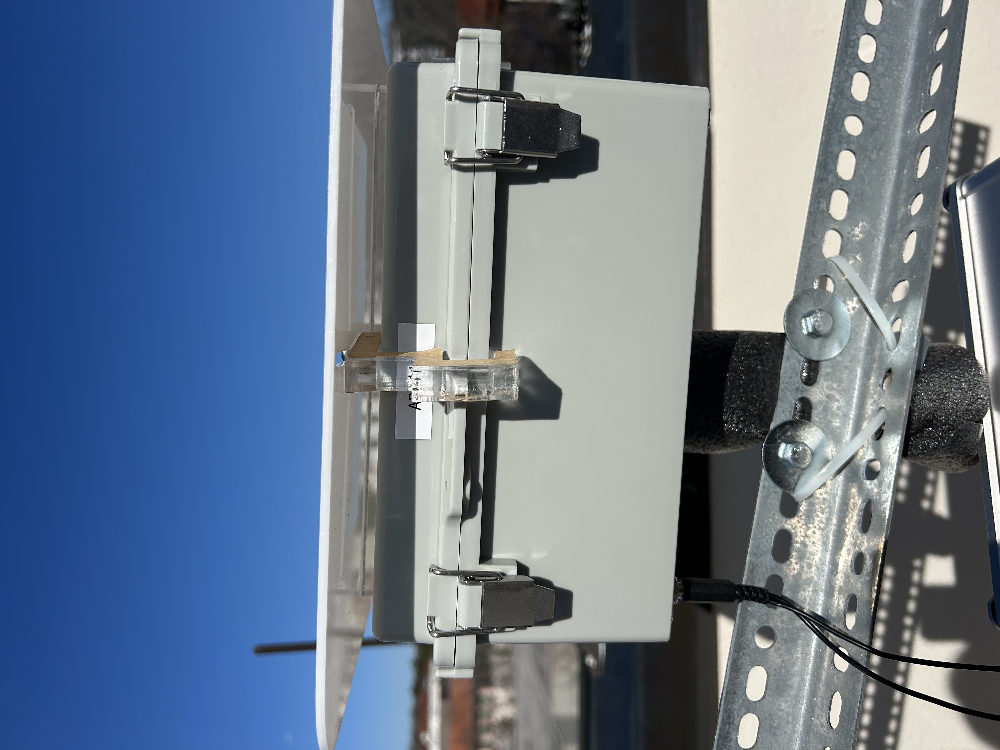
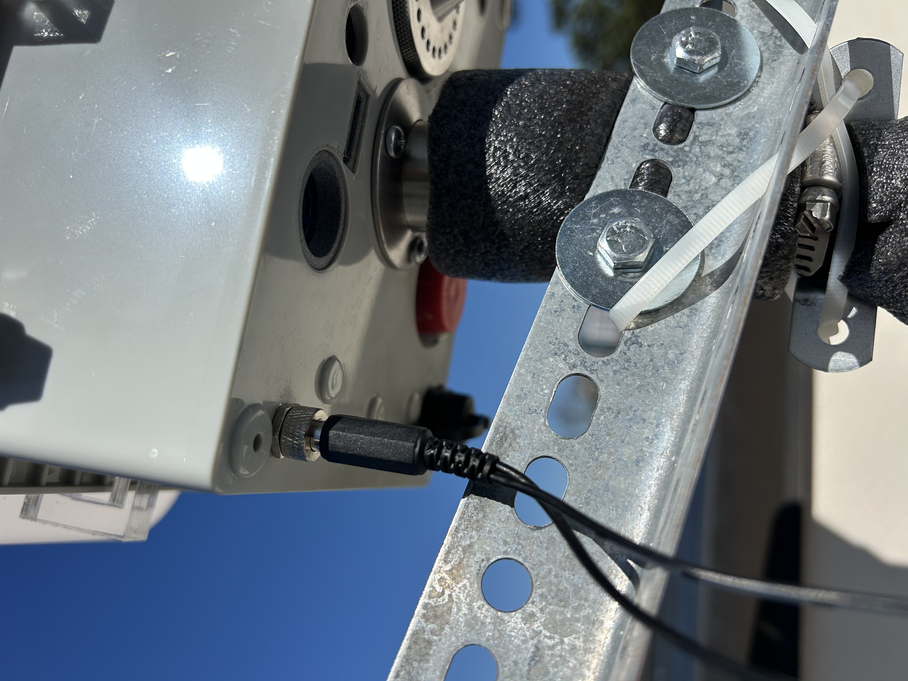
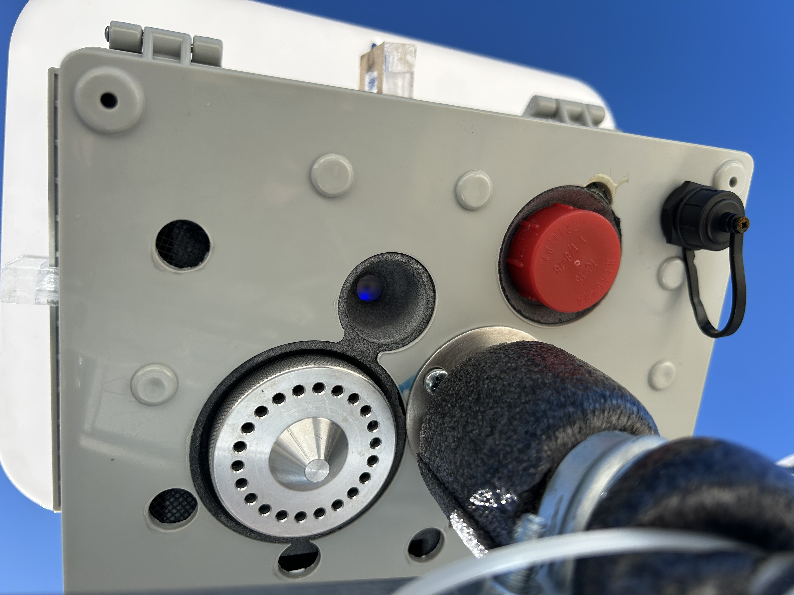
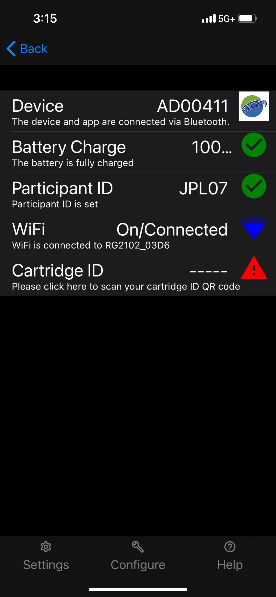
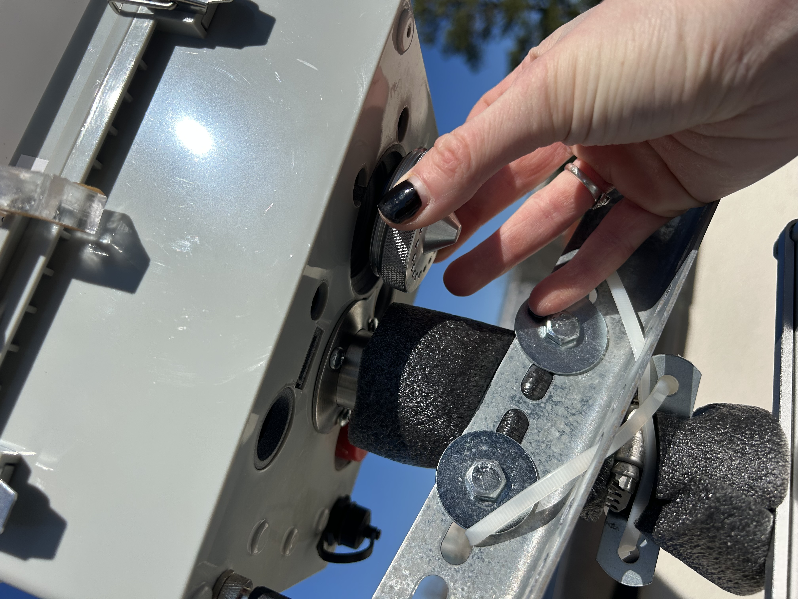
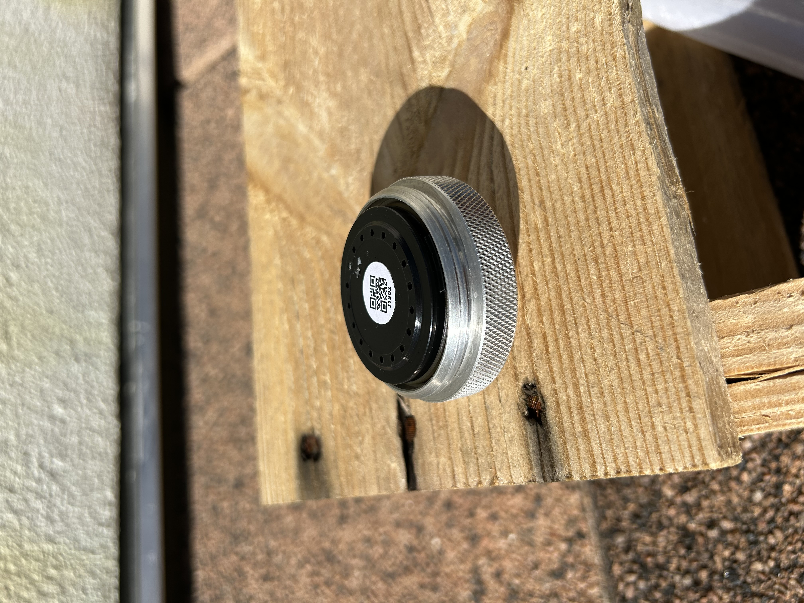

[Back to Home](index.html)

## Basic Setup Guide

Follow these steps to set up your AMOD device correctly.

{width=300px}
{width=300px}

*Setting up the AMOD: example manifold setup and weather cover installation*

{width=300px}

Connect your device to a power source. Check it is fully plugged in as in the photo above.

Once connected to power, start the device by pressing and holding the power button for 2-3 seconds.

{width=300px}

Check status of connection using the indicator light (inside center hole in bottom view).

A red, blinking light indicates the device is searching for a GPS signal. When the light is solid blue, it is ready to be connected. More info on colors can be found in the [LED Colors section](led_colors.html).

{width=300px}

Connect to the CEAMS App. Directions on how to install the app are located in the MAIA AMOD Manual.

Click 'Scan' if the device does not automatically appear. See the Manual for Wifi setup instructions.

Once wifi connection is established, the filter can be installed and the run can be initiated.

Select the cartridge ID option in the app. This will prompt you to take a photo of the filter to scan the QR code. Do so with the least direct handling as possible.

{width=300px}

Next: insert the filter. The silver cap holds the filter (place barcode-up, see below) which screws into the AMOD

{width=300px}

Fill out the filter tracking log.

For more details, refer to the FAQ sections on the left.
