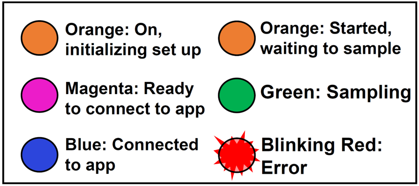

[Back to Home](index.html)

## What do the LED light colors mean?

{width=200px}

## Initial Troubleshooting for Blinking Red Light:

- If you are attempting to turn on the device while indoors, take the unit outside and turn it on to see if the issue persists.

- If you are attempting to turn on the device while outdoors, wait a few minutes to see if the blinking stops (the unit may be trying to search for a GPS signal).

- If issues persist and the LED is still blinking red, then please reach out to the Emory team ASAP for next steps.
